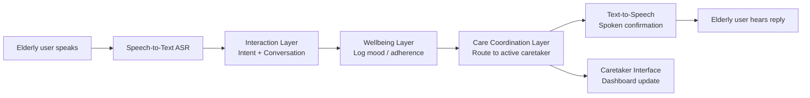
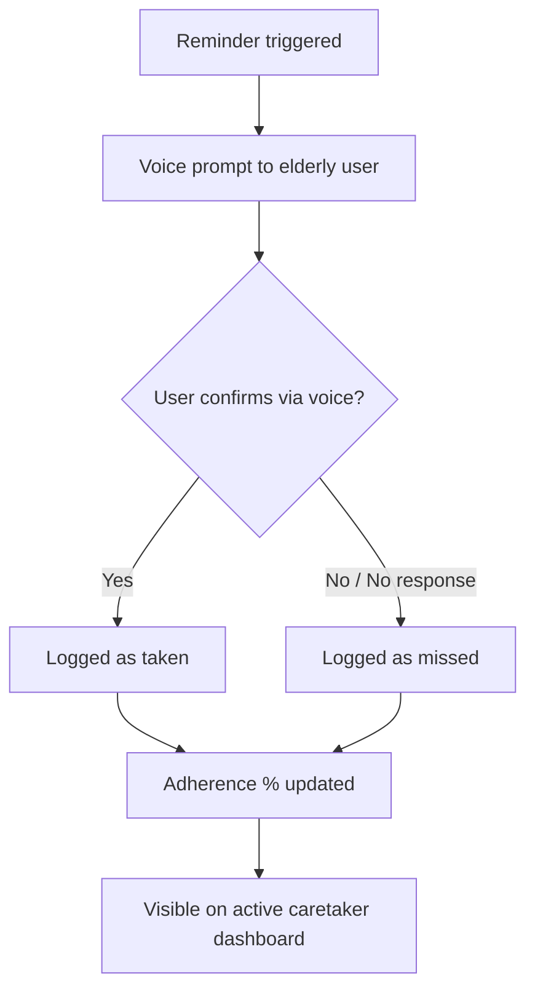
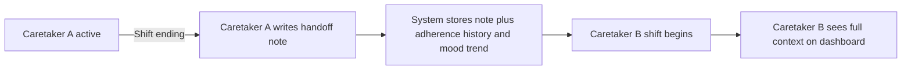

# CareContinuum

**A Voice-Assisted Mobile Platform for Elderly Wellbeing Monitoring and Caregiver Continuity**

> M.Tech Research Course Project — Amrita Vishwa Vidyapeetham, Coimbatore

---

## Overview

Most eldercare apps out there assume one static caregiver looking after one elderly person forever. That's rarely how it actually works. In reality, elderly individuals are often looked after by a **rotating set of caretakers** — family members, part-time aides, or shift-based helpers — who change every week or month. Every time that rotation happens, context gets lost: the new caretaker doesn't know if medicines were taken on time, doesn't know the person's mood has been dipping, doesn't know about the doctor's appointment coming up next week.

**CareContinuum** is my attempt at fixing that. It's a mobile platform built around:
- a **single elderly user profile** (the constant, no matter who's caring for them),
- a **voice-first interaction layer** so the elderly user never has to fight with a UI, and
- a **persistent care-coordination layer** that survives every caretaker handoff.

The core idea: **the system is the keeper of continuity, not any one caretaker.**

---

## Problem Statement

Elderly individuals who rely on multiple, rotating caretakers experience real discontinuity in care. New caretakers often walk in blind — no medication adherence history, no idea about recent mood or wellbeing trends, no clue about day-to-day preferences. That gap increases the risk of missed medications, delayed emergency response, and just generally worse care. There's also surprisingly little research on systems designed specifically for these **informal, rotating** caregiving relationships (as opposed to formal clinical shift handoffs in hospitals).

---

## Research Objectives

1. Design a **voice-first interaction model** suitable for elderly users — reminders, confirmations, and casual conversation.
2. Design and prototype a **caretaker-rotation and handoff mechanism** that preserves context (adherence history, mood trends, handoff notes) across caretaker changes.
3. Evaluate whether **passive wellbeing signals** (medication adherence, mood check-ins, game engagement trends) can meaningfully inform caretakers without requiring active data entry.
4. Assess **usability and acceptance** of the system among elderly users and caretakers through a small-scale scenario-based study.

---

## System Architecture

CareContinuum is built around three core layers, wrapped by an interaction layer on one end and a caretaker-facing output on the other.

![CareContinuum Architecture]

### 1. Interaction Layer (AI Voice Assistant)
The single front-door interface for the elderly user. Handles reading and confirming reminders, logging medication confirmations, running short daily mood check-ins, launching audiobooks/games on request, and triggering the emergency flow when needed. Built on speech-to-text (Whisper / cloud STT), an LLM conversation layer tuned for short, simple responses, and natural-sounding text-to-speech.

### 2. Care Coordination Layer (the core contribution)
Every elderly profile has a rolling list of caretaker assignments with start and end dates, so responsibility is always well-defined even mid-rotation. Reminders, adherence logs, and mood data route dynamically to whichever caretaker is currently active. When a shift ends, the outgoing caretaker leaves a short **handoff note** for the next one (e.g. "he's been more tired than usual," "doctor's appointment Thursday"). The emergency button always routes to the currently active caretaker, with emergency services as fallback.

### 3. Wellbeing Layer
Aggregates passive signals — medication adherence %, mood trend from daily check-ins, and engagement/cognitive trend from game performance (reaction time, accuracy) — into a simple weekly digest. This digest also feeds a **family visibility layer**: non-caretaker family members (e.g. children living elsewhere) get read-only visibility into these trends without full caretaker access.

---

## How a Request Flows Through the System

## Medication Adherence Loop

## Caretaker Rotation & Handoff

---

## Feature Breakdown

| Feature | Description |
|---|---|
| AI Voice Assistant | Conversational interface for reminders, confirmations, and casual check-ins |
| Medication Adherence Loop | Reminder → voice confirmation → logged history (not just a one-way reminder) |
| Caretaker Rotation & Handoff Notes | Time-bound caretaker assignments with handoff notes at shift end |
| Emergency Contact Button | One-tap connection to the currently active caretaker or emergency services |
| Mood Check-ins | Short daily voice check-in with sentiment trend logging over time |
| Family Visibility Layer | Weekly digest (adherence %, mood trend, activity level) for non-caretaker family |
| Audiobooks & Games | Entertainment features; game performance optionally logged as an engagement/cognitive trend |

---

## Prototype Scope (Course-Timeline Feasible)

Given the single-semester timeline, I'm prioritizing depth on the core contribution (caretaker rotation + continuity) over breadth. Minimum viable scope for this project:

- ✅ Working voice flow: reminder delivery → voice confirmation → adherence log
- ✅ Caretaker assignment model with time-bound rotation and a functioning handoff-note flow
- ✅ One demo caretaker dashboard view showing adherence history, mood trend, and the latest handoff note
- ✅ One playable game with basic performance logging (reaction time / accuracy)
- 🔜 Audiobooks, full family-digest automation, and fall detection — documented as designed future work rather than fully implemented this semester

---

## Methodology

1. **Literature review** — positioning the work against prior research in voice interfaces for older adults, eldercare reminder systems, and caregiver handoff/continuity literature (see References below).
2. **Design & prototyping** — iterative design of the voice interaction flow and caretaker data model, building a functional prototype covering the minimum scope above.
3. **Evaluation** — small-scale scenario-based user study (~5–10 participants: elderly users and/or caretakers), using a structured task (e.g. simulating a caretaker handoff and observing whether context transfers correctly) plus a standard usability questionnaire like the System Usability Scale (SUS).
4. **Analysis** — qualitative analysis of handoff-continuity outcomes, combined with quantitative usability scores and basic engagement metrics from the game/mood-logging components.

---

## Expected Outcomes

- A working prototype demonstrating voice-assisted reminders with confirmation logging
- A caretaker-rotation and handoff-note mechanism, evaluated for whether it improves context continuity relative to a no-handoff baseline
- Usability findings on voice interaction specifically for elderly users
- A documented framework (data model + interaction flow) that could generalize to other rotating-caregiver contexts

---

## Related Work / References

Starting points for the literature review (IEEE & ACM, 2025–2026), relevant to voice interaction, eldercare reminders, and caregiver-continuity:

1. Zhong, V., Studerus, E., Vonschallen, S. (2025). *Integrating LLM into a Socially Assistive Robot for Social Dialogue: An Exploratory Study in a Nursing Home.* IEEE RO-MAN 2025. [doi.org/10.1109/RO-MAN63969.2025.11217629](https://doi.org/10.1109/RO-MAN63969.2025.11217629)
2. Valdivia, K., Li, J. (2025). *Voice Familiarity in a Voice-Reminders App for Elderly Care Recipients and Their Family Caregivers.* IEEE Transactions on Human-Machine Systems, 55(4), 529-538. [doi.org/10.1109/THMS.2025.3582259](https://doi.org/10.1109/THMS.2025.3582259)
3. Namvarpour, M., Razi, A. (2025). *The Art of Talking Machines: A Comprehensive Literature Review of Conversational User Interfaces.* ACM CUI 2025. [doi.org/10.1145/3719160.3736621](https://doi.org/10.1145/3719160.3736621)
4. Boostani, R., Munteanu, C., Kuzminykh, A. (2025). *Towards Age-Inclusive Conversational Interfaces: Understanding Requirements Across Age Groups.* ACM CUI 2025. [dl.acm.org/doi/proceedings/10.1145/3719160](https://dl.acm.org/doi/proceedings/10.1145/3719160)
5. Green, A. et al. (2025). *Black Older Adults' Perception of Using Voice Assistants to Enact a Medical Recovery Curriculum.* Proceedings of the ACM on Human-Computer Interaction, 9(2), 1. [dl.acm.org/doi/10.1145/3711070](https://dl.acm.org/doi/10.1145/3711070)
6. Jang, G. et al. (2025). *Voice-Based Remote Care Program for Vulnerable Older Adults in a Rural Community: Single-Arm Pilot Clinical Study.* JMIR Aging, 8, e76653. [doi.org/10.2196/76653](https://doi.org/10.2196/76653)
7. Cuadra, A. et al. (2025). *Voice Assistants for Health Self-Management: Designing for and with Older Adults.* CHI 2025. [doi.org/10.1145/3706598.3713839](https://doi.org/10.1145/3706598.3713839)
8. (2025). *Designing Intelligent Voice Assistants for Older Adults' Collaborative Care: Exploring Supportive and Non-Supportive Interactions.* Proceedings of the ACM on Human-Computer Interaction. [doi.org/10.1145/3757465](https://doi.org/10.1145/3757465)
9. Tang, C. et al. *Awareness and handoffs in home care: coordination among informal caregivers.* Behaviour & Information Technology, 37(1), 66-86. [doi.org/10.1080/0144929X.2017.1405073](https://doi.org/10.1080/0144929X.2017.1405073)

> Note: Some references are ACM CHI/CUI/HCI venues rather than pure IEEE — mixing CHI/CSCW/ACM-HCI with IEEE venues is standard practice for an M.Tech literature review in this space.

---

## Project Status

This repo currently holds the **project scope and system design** for CareContinuum, developed as part of my M.Tech research coursework. Prototype implementation is in progress — code, data models, and the demo caretaker dashboard will be added here as the semester progresses.

---

## Authors

Built by **Tanala Phanendra, Ganta Anand, Mohammed Liyakat Ali** — M.Tech CSE, Amrita School of Computing, Coimbatore.
